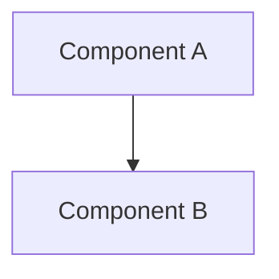

> **Retired by [ADR-0020](../adrs/0020-move-architecture-views-into-wiki.md).** Do not create new files from this template. System-wide architecture views now live in [`../wiki/architecture/`](../wiki/architecture/) as informal wiki pages with no formal template or status lifecycle. This file remains only so historic links resolve.

# <View title>

> **Status**: Accepted
> **Authors**: <name> <email>
> **Last reviewed**: YYYY-MM-DD
> **Tracks**: [ADR-NNNN](../adrs/NNNN-<title>.md)

> **Implementation status:** <One line: what of this view exists in code today vs what is planned. Architecture views track a mid-build system — be honest about the line. Mark planned pieces *(planned)* in the diagram and tables below.>

## Purpose

<One short paragraph: which slice of the system this view shows (components / a request's path / deployment), and why a reader opens it. State what this view does NOT cover and link the sibling view that does.>

## Diagram



<Author the diagram as a fenced ```mermaid block — plain text, diffable, rendered by GitHub and the docs site. Keep it beside the prose so the two never drift.>

## Components

<A table of the elements in the diagram: each one's boundary/role, what it connects to, and whether it exists today or is planned.>

| Component | Boundary / role | Connects to | Status |
| --------- | --------------- | ----------- | ------ |
| <name>    | <one line>      | <neighbours>| exists / planned |

## Boundaries

<The boundaries that matter in this view — what is in-process vs across a network, what is external, what must never cross. One bullet each.>

- <boundary statement>

## Open questions

<Unresolved items with an owner, or `_None open._`>

- <question> Owner: <who> — resolve by <when/trigger>.

## References

- <sibling architecture views>
- <the ADRs this view stitches (also in `Tracks`)>
- <the specs / conventions / source files this view points at>
