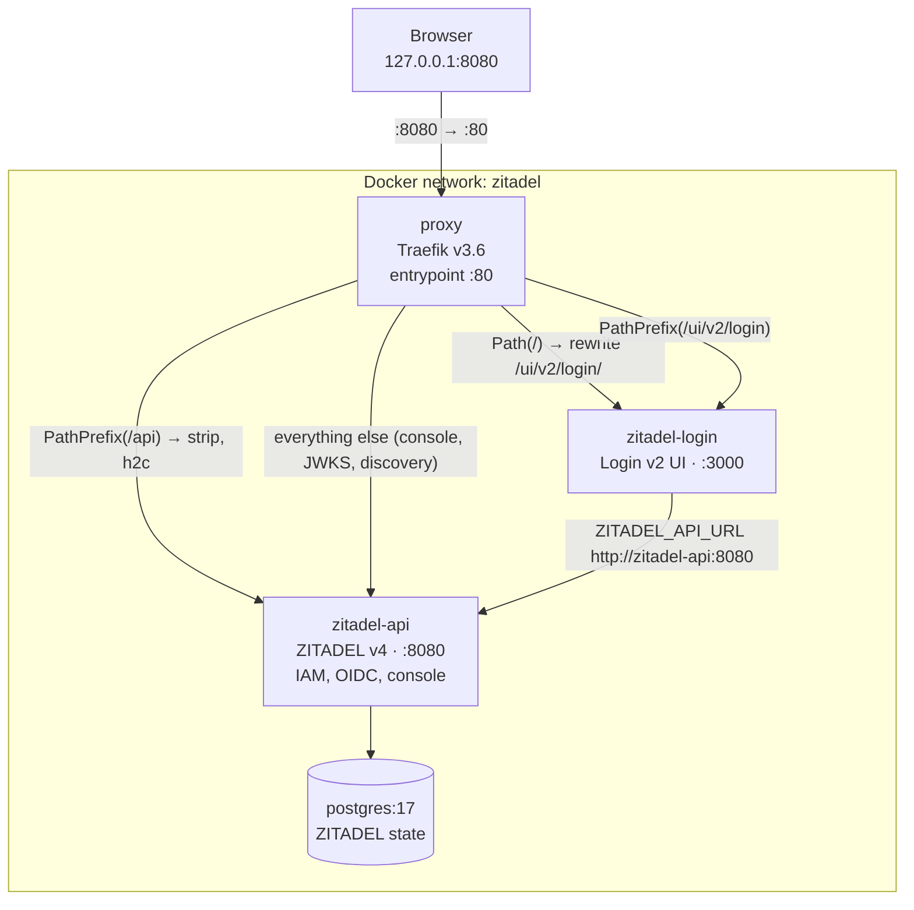

# Deployment topology

> **Status**: Accepted
> **Authors**: Minh Hieu Tran <hieu.tran21198@gmail.com>
> **Last reviewed**: 2026-06-29
> **Tracks**: [ADR-0006](../adrs/0006-zitadel-identity-auth.md)

> **Implementation status:** The **local** topology below exists (`deploy/local/docker-compose.yaml`) — Postgres, ZITADEL API, ZITADEL Login v2, and a Traefik proxy. The portal service is **not yet** wired into this compose stack (its HTTP binaries are planned); it runs from the devenv shell against its own app Postgres. A non-local (staging/prod) topology is not yet defined.

## Problem

The runtime wiring of the system — which processes run, how they network, which ports are exposed, and how requests are routed — is documented only inline in `deploy/local/docker-compose.yaml` comments and Traefik labels. This view extracts that into a single topology picture so a contributor can see the deployed shape without reading 170 lines of compose labels.

## Goals

- A diagram of the local stack: every container, its network, exposed ports, and the proxy routing rules.
- The two Postgres instances (ZITADEL's vs the app's) made explicit so they are never conflated.
- The single ingress (`127.0.0.1:8080`) and how Traefik routes paths to ZITADEL API vs Login v2.

## Non-goals

- Component responsibilities — [system-overview.md](system-overview.md).
- ZITADEL configuration knobs — `deploy/local/.env.example` and [ADR-0006](../adrs/0006-zitadel-identity-auth.md).
- A production deployment design — not yet defined; this view is local-only.

## Background

- The local auth stack lives in `deploy/local/docker-compose.yaml` ([ADR-0006](../adrs/0006-zitadel-identity-auth.md)): four services on a single `zitadel` Docker network.
- Bring-up: `cp .env.example .env` (set `ZITADEL_MASTERKEY`), `docker compose up -d --wait`, then `http://localhost:8080/ui/console`.
- The **app** Postgres (for portal aggregates, with the `admin`/`writer`/`reader` roles) is provisioned by the postgres devenv module (`packages/nix/core/services/postgres/`), **separate** from the ZITADEL Postgres in this compose file.

## Design

### Local stack (`deploy/local/`)

### Containers

| Container | Image | Role | Exposed | Depends on |
| --------- | ----- | ---- | ------- | ---------- |
| **proxy** | `traefik:v3.6.8` | Reverse proxy / router. The only ingress. Routes by path to API vs Login. | `127.0.0.1:8080 → :80` | api, login (healthy) |
| **zitadel-api** | `ghcr.io/zitadel/zitadel:v4.13.0` | IAM core: OIDC/OAuth, console, discovery, JWKS. `start-from-init`. | via proxy | postgres (healthy) |
| **zitadel-login** | `ghcr.io/zitadel/zitadel-login:v4.13.0` | Login v2 UI (Next.js). Talks to the API over the internal network. | via proxy | api (healthy) |
| **postgres** | `postgres:17.2-alpine` | ZITADEL's state store. **Not** the app DB. | `127.0.0.1:5432:5432` | — |

### Routing (Traefik, by priority)

| Priority | Rule | Target | Notes |
| -------- | ---- | ------ | ----- |
| 400 | `Path(/)` | zitadel-login | Rewrites root → `/ui/v2/login/`. |
| 250 | `PathPrefix(/ui/v2/login)` | zitadel-login | The Login v2 UI. |
| 200 | `PathPrefix(/api)` | zitadel-api | Strips `/api`; `h2c` for gRPC + Connect-RPC. |
| 100 | everything else (not `/`, `/api`, `/ui/v2/login`) | zitadel-api | Console, discovery, JWKS. |

### Two Postgres instances — do not conflate

- **ZITADEL Postgres** — the `postgres` container in this compose file; stores ZITADEL's own IAM state. Exposed on `127.0.0.1:5432` locally.
- **App Postgres** — provisioned by the postgres devenv module for the portal's aggregates with the RLS roles ([role and scope contract](../conventions/database/role-and-scope-contract.md)). The portal connects here, never to ZITADEL's DB.

> Both default to port 5432 locally; when running both, give the app DB a distinct port to avoid the clash. This is an open item (see below).

## Alternatives considered

- **Expose each ZITADEL service on its own host port (no proxy).** Rejected: ZITADEL v4 Login v2 expects a single external origin with path-based routing; the Traefik proxy provides the one ingress ZITADEL's URLs are configured against.
- **Reuse the ZITADEL Postgres for the app.** Rejected: couples app schema/migrations and RLS roles to ZITADEL's state DB and lifecycle. The app DB is provisioned independently.

## Open questions

- The ZITADEL Postgres and the app Postgres both default to `5432` locally. What is the canonical port split (or compose-vs-devenv separation) when both run? Owner: deploy — resolve when the portal joins the local stack.
- Is there a non-local (staging/prod) topology, or is deployment per-environment ad hoc for now? Owner: deploy.

## Implementation plan

- [x] Document the local topology (this view).
- [ ] Add the portal service to the local stack (or document the devenv-vs-compose split) once its HTTP binaries exist.
- [ ] Resolve the app-vs-ZITADEL Postgres port split.
- [ ] Define a non-local topology when an environment beyond local exists.
- [ ] Update this view whenever `deploy/` changes — bump `Last reviewed`.

## References

- [system-overview.md](system-overview.md) · [request-flow.md](request-flow.md) — the other two architecture views.
- [ADR-0006](../adrs/0006-zitadel-identity-auth.md) — ZITADEL as the identity/auth provider.
- `deploy/local/docker-compose.yaml` — the source this view documents.
- `deploy/local/.env.example` — the local config surface.
- [`conventions/database/role-and-scope-contract.md`](../conventions/database/role-and-scope-contract.md) — the app DB's roles (distinct from ZITADEL's DB).
