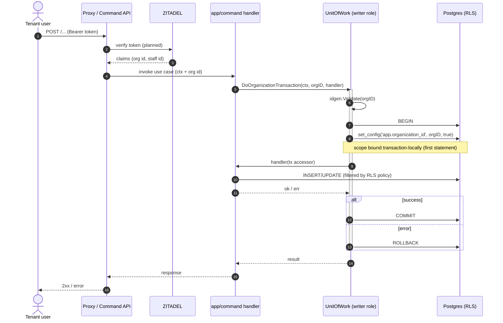

# Request flow

> **Status**: Accepted
> **Authors**: Minh Hieu Tran <hieu.tran21198@gmail.com>
> **Last reviewed**: 2026-06-29
> **Tracks**: [ADR-0003](../adrs/0003-service-architecture.md), [ADR-0008](../adrs/0008-tenant-scoped-unit-of-work-rls.md), [ADR-0009](../adrs/0009-safe-system-scope-rls.md)

> **Implementation status:** The in-process flow (delivery → app → infra → DB with transaction-local scope binding) describes the **intended** path. The `organization`-scope binding exists in `uow.go`/`readstore.go`; the HTTP delivery binaries and ZITADEL token verification are planned. The RLS policy the binding targets is itself a planned migration ([ADR-0008](../adrs/0008-tenant-scoped-unit-of-work-rls.md)).

## Problem

The [system overview](system-overview.md) shows *what* the components are; it does not show *how* a single request moves through them — where authentication happens, where the tenant scope is bound, and where the database enforces isolation. This view traces one request end-to-end so a contributor knows exactly which layer owns which responsibility and where the tenant boundary is established.

## Goals

- A step-by-step trace of an authenticated write and an authenticated read.
- The exact point where the `organization` scope is bound (the RLS chokepoint) and why it is transaction-local.
- Where the future `system` scope enters, and why it never touches the tenant-facing path.

## Non-goals

- Component inventory and boundaries — [system-overview.md](system-overview.md).
- RLS policy SQL and the role/GUC contract — [`conventions/database/role-and-scope-contract.md`](../conventions/database/role-and-scope-contract.md) and the [`rls-patterns` skill](../../tools/ai/skills/rls-patterns/SKILL.md).
- Per-aggregate domain rules — the portal domain packages.

## Background

- **Dependency direction** ([ADR-0003](../adrs/0003-service-architecture.md)): `delivery/ → app/ → domain/ ← infra/`. `app/` depends on ports (`command.UnitOfWork`, `query.ReadStore`), never on concrete infra.
- **Every write flows through `UnitOfWork.DoOrganizationTransaction`**; every read through `ReadStore.DoOrganizationQuery`. Both validate the org id, bind the scope as the first statement, then run the handler against a tx-scoped accessor.
- **Scope is transaction-local** (`set_config(..., true)`) so a pooled connection never leaks one request's scope to the next.

### Write request (command side)

### Read request (query side)

The read path mirrors the write path through `ReadStore.DoOrganizationQuery`: validate org id → `BEGIN` → bind `app.organization_id` transaction-locally → run the handler against a tx-scoped `TransactionalReadStore` (connected as `reader`) → `COMMIT`. An unbound read **fails closed** (zero rows) against the `FORCE`d policy, so reads are RLS-bound exactly like writes — there is no scope-less read path.

### Where `system` scope fits (planned)

The cross-tenant `system` scope is **not** on the tenant-facing path above. Per [ADR-0009](../adrs/0009-safe-system-scope-rls.md), a `system` consumer is a separate runtime (worker / back-office) connecting as a dedicated `system_reader` role, obtaining a capability from an authorizer, then calling `DoSystemQuery(ctx, cap, handler)`. The tenant-facing `writer`/`reader` roles have no `system` policy branch, so even if `app.scope='system'` were set on a tenant connection, it would match no policy and fail closed.

## Alternatives considered

- **Bind the scope in the HTTP middleware instead of the UoW.** Rejected: the UoW/ReadStore is the single chokepoint every write/read already passes through; binding there guarantees no path escapes it, whereas middleware can be bypassed by non-HTTP callers (jobs, CLIs).
- **Carry the scope implicitly in `ctx`.** Rejected ([ADR-0008](../adrs/0008-tenant-scoped-unit-of-work-rls.md)): an explicit `organization.ID` parameter makes "declare your scope" a call-site fact, not a runtime surprise.

## Open questions

- Where exactly does token→org-id extraction live once ZITADEL integration lands — delivery middleware or an app-layer auth port? Owner: portal — resolve with the ZITADEL integration ([ADR-0006](../adrs/0006-zitadel-identity-auth.md)).

## Implementation plan

- [x] Document the intended request flow (this view).
- [ ] Land HTTP delivery binaries so the proxy→handler hops exist.
- [ ] Wire ZITADEL token verification → org-id extraction.
- [ ] Land the RLS policy migration so the binding actually filters.
- [ ] Update this view if the chokepoint or auth boundary moves — bump `Last reviewed`.

## References

- [system-overview.md](system-overview.md) · [deployment-topology.md](deployment-topology.md) — the other two architecture views.
- [ADR-0008](../adrs/0008-tenant-scoped-unit-of-work-rls.md) · [ADR-0009](../adrs/0009-safe-system-scope-rls.md) — scope binding + system scope.
- [`conventions/database/role-and-scope-contract.md`](../conventions/database/role-and-scope-contract.md) — the role + GUC contract this flow applies.
- [`conventions/go/service-architecture.md` § Unit of Work](../conventions/go/service-architecture.md#unit-of-work) — the UoW/ReadStore pattern.
- `services/portal/internal/infra/postgres/uow/uow.go` · `.../readstore/readstore.go` — the binders (`bindOrganizationRLS`).
