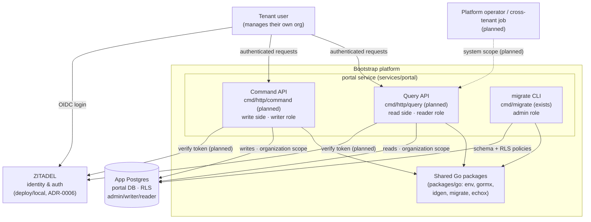

# System overview

> **Status**: Accepted
> **Authors**: Minh Hieu Tran <hieu.tran21198@gmail.com>
> **Last reviewed**: 2026-06-29
> **Tracks**: [ADR-0003](../../adrs/0003-service-architecture.md), [ADR-0006](../../adrs/0006-zitadel-identity-auth.md), [ADR-0008](../../adrs/0008-tenant-scoped-unit-of-work-rls.md)

> **Implementation status:** This view describes the **intended** system. What exists today: the `portal` service code (Clean Arch + CQRS, `organization` scope), the shared Go/Nix packages, and the local ZITADEL stack (`deploy/local/`). What is planned: the portal's two HTTP binaries (`cmd/http/{command,query}` are dir-only), the portal↔ZITADEL integration (`infra/zitadel/`, ADR-0006 `Proposed`), and the RLS policy migration (ADR-0008). Planned pieces are marked *(planned)* below.

## Problem

The system's big picture is fragmented: the root README shows a folder tree, `deploy/local/docker-compose.yaml` documents the auth stack inline, and the tenancy/identity decisions live in separate ADRs. There is no single place to see *what the running system is* — its components, their boundaries, how they relate, and what they depend on. This view is that place: a C4-style context + container map that stitches the existing pieces (and the named-but-planned ones) into one picture.

## Goals

- One diagram + narrative showing every component, its responsibility, and its boundary.
- The external dependencies (ZITADEL for identity, Postgres for state) and how the system relates to them.
- A clear "exists today vs planned" line so the map is honest about the scaffold stage.

## Non-goals

- Per-service internal structure (DDD layers, repos, UoW) — that's [`conventions/go/service-architecture.md`](../../conventions/go/service-architecture.md) and each service's `AGENTS.md`.
- Request-by-request flow — see [request-flow.md](request-flow.md).
- Deployment wiring detail (proxy routes, healthchecks) — see [deployment-topology.md](deployment-topology.md).

## Background

- **Monorepo, Go workspace.** Three Go modules (`packages/go`, `services/portal`, `tools`) bound by `go.work`; Nix/devenv owns the toolchain ([ADR-0007](../../adrs/0007-nix-devenv-developer-environment.md)).
- **Service pattern.** Every service follows Clean Architecture + CQRS + DDD ([ADR-0003](../../adrs/0003-service-architecture.md)): physical read/write split, two HTTP binaries intended per service.
- **Identity.** ZITADEL is the identity/auth provider ([ADR-0006](../../adrs/0006-zitadel-identity-auth.md), `Proposed`); run locally via `deploy/local/`.
- **Tenancy.** Multi-tenant; Postgres RLS is the isolation authority with `organization`/`system` scopes ([ADR-0008](../../adrs/0008-tenant-scoped-unit-of-work-rls.md), [ADR-0009](../../adrs/0009-safe-system-scope-rls.md)).

## Design

### Context + container map (C4 L1/L2)

### Components

| Component | Boundary / role | Connects to | Status |
| --------- | --------------- | ----------- | ------ |
| **portal — Command API** | Write side; HTTP handlers → `app/command` → domain → `infra`. Connects to Postgres as `writer` (`NOBYPASSRLS`), binds the `organization` scope per transaction. | App Postgres (write), ZITADEL (token verify) | API binary planned; app/domain/infra exist |
| **portal — Query API** | Read side; physically separate from the write side ([ADR-0003](../../adrs/0003-service-architecture.md)). Connects as `reader`, binds a scope per query. | App Postgres (read), ZITADEL (token verify) | API binary planned; readstore exists |
| **portal — migrate CLI** | Schema + RLS policy management. Connects as `admin` (`SUPERUSER`, `BYPASSRLS`) — the only `BYPASSRLS` path, never request-time. | App Postgres (DDL) | Exists (`cmd/migrate`) |
| **Shared Go packages** | Cross-service libraries: `env`, `gormx`, `idgen` (UUIDv7), `migrate` (goose), `server/echox`. No business logic. | — | Exists |
| **ZITADEL** | External identity provider: OIDC login, token issuance/verification. Tenant users authenticate here. | App Postgres is **separate** from ZITADEL's own DB | Local stack exists; portal integration planned |
| **App Postgres** | System-of-record for portal aggregates (`organizations`, `staff`). RLS-enforced tenant isolation; three roles (`admin`/`writer`/`reader`). | — | Tables exist; RLS policy migration planned |

### Boundaries that matter

- **Read/write split is physical**, not logical — two binaries, two roles, two DB connection profiles. A request never crosses sides in-process.
- **Identity is external.** The platform delegates authentication to ZITADEL; the portal owns *authorization within an org* (`staff.Role`) and *tenant data isolation* (RLS), not login.
- **ZITADEL's Postgres is not the app's Postgres.** The local stack ([deployment-topology.md](deployment-topology.md)) runs a Postgres for ZITADEL state; the app DB is provisioned separately by the postgres devenv module. Do not conflate them.
- **`admin` never serves requests.** The only `BYPASSRLS` path is migrations.

## Alternatives considered

- **Keep the big picture in the root README only.** Rejected: the README is a folder-tree + scaffold narrative; it has no runtime component/dependency map and is not a living design surface.
- **Put the system view in an ADR.** Rejected: ADRs are append-only decisions; a system map is a living document that changes as components ship. The ADRs are linked via `Tracks`.

## Open questions

- Will command and query deploy as two separate processes in all environments, or co-locate behind one proxy in dev? Owner: deploy — resolve when the HTTP binaries land.

## Implementation plan

- [x] Document the intended component map (this view).
- [ ] Build the portal HTTP binaries (`cmd/http/{command,query}`) — flips those components to "exists".
- [ ] Wire portal ↔ ZITADEL token verification ([ADR-0006](../../adrs/0006-zitadel-identity-auth.md), `infra/zitadel/`).
- [ ] Land the RLS policy migration ([ADR-0008](../../adrs/0008-tenant-scoped-unit-of-work-rls.md)).
- [ ] Update this view whenever a component is added/removed — bump `Last reviewed`.

## References

- [request-flow.md](request-flow.md) · [deployment-topology.md](deployment-topology.md) — the other two architecture views.
- [ADR-0003](../../adrs/0003-service-architecture.md) — service-internal pattern (Clean Arch + CQRS).
- [ADR-0006](../../adrs/0006-zitadel-identity-auth.md) — ZITADEL as identity provider.
- [ADR-0008](../../adrs/0008-tenant-scoped-unit-of-work-rls.md) · [ADR-0009](../../adrs/0009-safe-system-scope-rls.md) — tenant isolation model.
- [Portal database schema](../../../services/portal/docs/specs/database-schema.md) — the app DB's tables.
- [`conventions/go/service-architecture.md`](../../conventions/go/service-architecture.md) — per-service internal structure.
