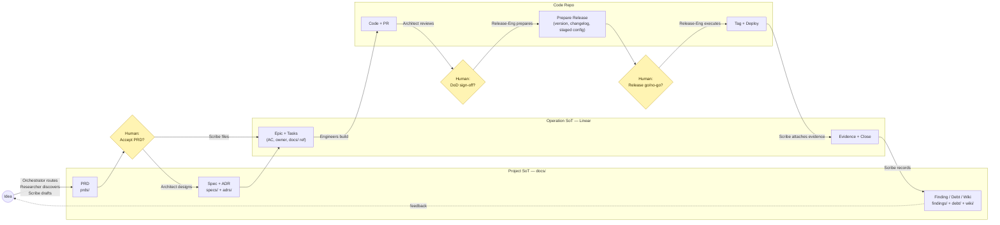
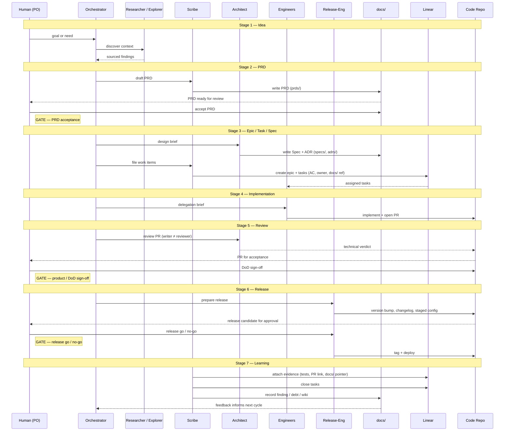

# Implementation Workflow

> Informal quick-reference (outside the 7 formal `docs/` tracks). This is the
> operating model for how humans and AI agents run the SDLC pipeline. State
> lifecycle + evidence-at-close:
> [`evidence-based-delivery.md`](../conventions/delivery/evidence-based-delivery.md)
> ([ADR-0017](../adrs/0017-evidence-based-delivery.md)). Full RACI:
> [`agile-roles.md`](agile-roles.md).

## Pipeline

Every non-trivial change walks seven stages. The sequence is fixed; what varies
is how much ceremony each stage earns. Three human authority gates sit inline —
nothing crosses them without human approval.

### Feature lifecycle

The sequence diagram walks one feature end-to-end, showing which actor writes
what, where, at each stage.

## Sources of truth

The pipeline touches two authoritative stores:

- **Project SoT (`docs/`)** — the durable record of what and why: PRDs, specs,
  ADRs, conventions, glossary, findings, debt, wiki (incl.
  [`architecture/`](architecture/)).
- **Operation SoT (Linear)** — the live delivery state: who, when, sprint,
  status.

Neither blindly overwrites the other. The ownership rules and sync protocol are
in [`jira-linear-sync.md`](jira-linear-sync.md) (Rules 1-3).

## Operating rules

### Rule 4 — Every task must trace back

Every tracked item must trace back to its `docs/` source record and carry
evidence at close. A task with no `docs/` reference is not filed.

The chain depends on the work type:

- **Feature work:** `PRD -> Spec -> Epic -> Task -> Code/PR -> Release`
- **Debt / finding / chore work:** starts at the debt entry (`debt/`) or finding
  (`findings/`), not a PRD — the rest of the chain still applies.

The links travel in two directions via front-matter fields the track formats
define:

- **Forward** (`Tracks`, `Realized by`): a spec's `Tracks` field cites the PRD;
  a PRD's `Realized by` field lists the specs, ADRs, and Linear issues that
  realise it. These fill over time as downstream work materialises.
- **Back** (evidence at close): when a Linear task moves to Done, it carries raw
  verification output, the merged PR / commit link, and the `docs/` pointer per
  [`evidence-based-delivery.md`](../conventions/delivery/evidence-based-delivery.md).

### Rule 5 — Agents do not invent authority

Agents draft, inspect, implement, and propose. Three decisions stay with the
human:

1. **Product intent** — what we build and why (PRD acceptance).
2. **Priority and sprint scope** — what we build next.
3. **Release go/no-go** — what we ship.

An agent may recommend; a human decides. The full RACI lives in
[`agile-roles.md`](agile-roles.md).

> Rules 1-3 (Project owns product truth; Jira/Linear owns delivery truth; No
> blind two-way sync) live in [`jira-linear-sync.md`](jira-linear-sync.md).

## Actors by stage

| # | Stage | Artifact | Where | Actor(s) | Human gate |
|---|-------|----------|-------|----------|------------|
| 1 | **Idea** | Raw signal (need, debt encounter, finding) | — | Orchestrator routes; Researcher / Explorer discover | — |
| 2 | **PRD** | Requirements (EARS, solution-free) | [`prds/`](../prds/) | Scribe drafts; Researcher supplies domain input | **PRD acceptance** |
| 3 | **Epic / Task / Spec** | Feature design + work items | [`specs/`](../specs/) + [`adrs/`](../adrs/) + Linear | Architect designs; Scribe files items (AC, owner, docs/ ref) | — |
| 4 | **Implementation** | Code + PR | Code repo | Engineers (backend / frontend) | — |
| 5 | **Review** | Technical verdict + DoD | Code repo | Architect reviews (writer ≠ reviewer) | **Product / DoD sign-off** |
| 6 | **Release** | Prepare (version, changelog, staged config) then tag + deploy after gate | Code repo | Release-Eng prepares; Human authorizes; Release-Eng executes | **Release go/no-go** |
| 7 | **Learning** | Investigation + follow-up | [`findings/`](../findings/) + [`debt/`](../debt/) + [`wiki/`](./) | Scribe records; Architect promotes to ADR/spec when needed | — |

## References

- State lifecycle + evidence gate: [`../conventions/delivery/evidence-based-delivery.md`](../conventions/delivery/evidence-based-delivery.md) · [ADR-0017](../adrs/0017-evidence-based-delivery.md)
- Track formats + lifecycle: [`../AGENTS.md`](../AGENTS.md)
- RACI: [`agile-roles.md`](agile-roles.md)
- Agent capabilities + posture: [`agent-team.md`](agent-team.md)
- Two-sources-of-truth sync (Rules 1-3): [`jira-linear-sync.md`](jira-linear-sync.md)
- Architecture views: [`architecture/`](architecture/)
