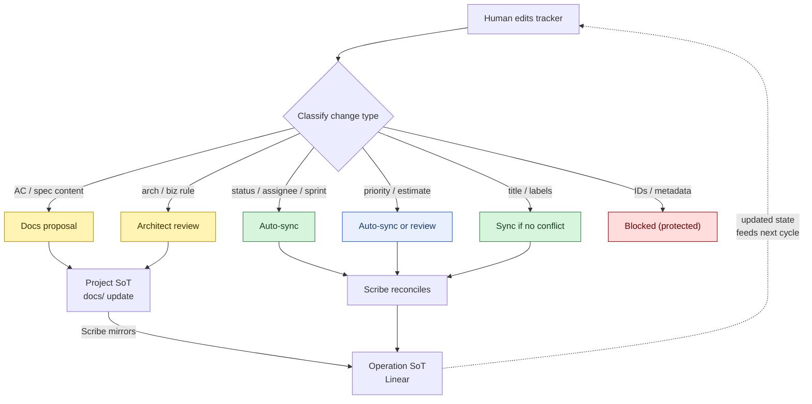

# Jira / Linear Sync

> Informal quick-reference (outside the 7 formal `docs/` tracks). This is the
> operating model for how Project docs and the Jira/Linear tracker stay in sync.
> State lifecycle:
> [`evidence-based-delivery.md`](../conventions/delivery/evidence-based-delivery.md)
> ([ADR-0017](../adrs/0017-evidence-based-delivery.md)). Pipeline view:
> [`implementation-workflow.md`](implementation-workflow.md).

## Two kinds of source of truth

The workspace splits truth in two. **Project** is the durable knowledge base —
what we are building, why, and how it is designed. **Operation** (today: Linear;
a Jira MCP exists but is disabled by default, so "Jira/Linear" names the role)
is the live delivery tracker — who is doing what, when, and in which sprint.

```text
Project = truth of what and why.
Jira/Linear = truth of who, when, and current delivery state.
Agents = execution assistants.
Humans = authority and acceptance.
```

Neither side may blindly overwrite the other. The project docs are not a mirror
of the tracker, and the tracker is not a mirror of the docs — they are two
projections of the same work, each authoritative in its own dimension.

## Ownership

| Concern | Authoritative home |
|---------|--------------------|
| Product intent | Project — PRDs, goals, scope |
| Technical design | Project — specs, ADRs, conventions |
| Delivery state | Jira/Linear — status, assignee, sprint/cycle |
| Team planning | Jira/Linear — priority, estimate, ownership |
| Knowledge | Project — glossary, findings, wiki (incl. [`architecture/`](architecture/)), debt |
| Implementation | Code repo |

## Project artifacts

| Artifact | Track | Status |
|----------|-------|--------|
| PRDs | [`prds/`](../prds/) | Active |
| Specs | [`specs/`](../specs/) | Active |
| Glossary | [`glossary/`](../glossary/) | Active |
| Conventions | [`conventions/`](../conventions/) | Active |
| Debt | [`debt/`](../debt/) | Active |
| Findings | [`findings/`](../findings/) | Active |
| Wiki | [`.`](./) (incl. [`architecture/`](architecture/) per [ADR-0020](../adrs/0020-move-architecture-views-into-wiki.md), superseding ADR-0010) | Active |
| ADRs | [`adrs/`](../adrs/) | Active |

## Operating rules

### Rule 1 — Project owns product truth

A change to what the system should do or why starts in `docs/` and propagates
*out* to the tracker. The tracker never overwrites product intent.

### Rule 2 — Jira/Linear owns delivery truth

A change to status, assignee, sprint, or estimate starts in the tracker and
propagates *out* to status reports. Docs never overwrite delivery fields.

### Rule 3 — No blind two-way sync

Every edit is classified by change type before it crosses the boundary. The
table below decides the route.

#### Classification of human edits in Jira/Linear

| Change type | Route |
|-------------|-------|
| Status / assignee / sprint | Auto-sync into status reports and the Scribe's record |
| Priority / estimate | Auto-sync *or* review — flag if it contradicts a `docs/` priority signal (e.g. a `Critical` debt encounter) |
| Title / labels | Sync if no conflict with a `docs/` record; flag conflicts for the Scribe |
| Acceptance criteria / spec content | **Do not sync.** Create a proposal in `docs/` (PRD, spec, or debt item) for human review |
| Architecture / business rule | **Do not sync.** Route to Architect for review; may produce an ADR or spec |
| Internal IDs / sync metadata | **Protected.** Never written into `docs/`; never read from `docs/` as truth |

Project docs never blindly overwrite Jira/Linear operation fields, and
Jira/Linear never blindly overwrites project docs.

> Rules 4-5 (Every task must trace back; Agents do not invent authority) live in
> [`implementation-workflow.md`](implementation-workflow.md).

## Sync cycle

Both directions form a continuous loop: tracker edits are classified and routed;
docs changes are mirrored back into Linear by the Scribe.



## References

- State lifecycle + evidence gate: [`../conventions/delivery/evidence-based-delivery.md`](../conventions/delivery/evidence-based-delivery.md) · [ADR-0017](../adrs/0017-evidence-based-delivery.md)
- Architecture views moved to wiki: [ADR-0020](../adrs/0020-move-architecture-views-into-wiki.md)
- Track formats + lifecycle: [`../AGENTS.md`](../AGENTS.md)
- Pipeline + Rules 4-5: [`implementation-workflow.md`](implementation-workflow.md)
- RACI: [`agile-roles.md`](agile-roles.md)
- Agent capabilities + posture: [`agent-team.md`](agent-team.md)
